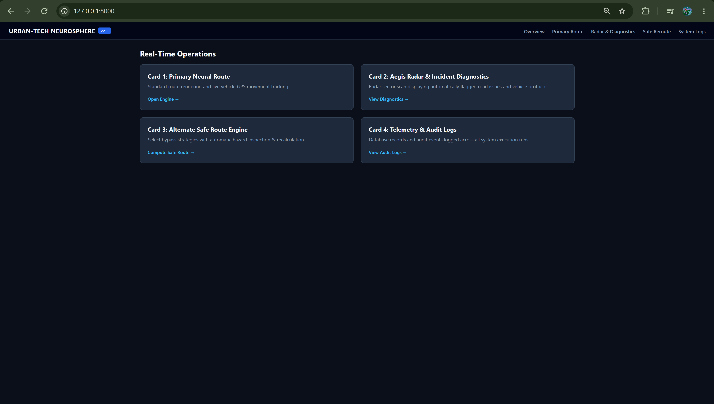

# 📡 URban-Tech-NeuroSphere-X | 

<p align="center">
  
  
  
  
  
  
</p>

---

## 🚁 Overview

**URban-Tech-NeuroSphere-X** is an intelligent, real-time tactical airspace monitoring system centered around **Kempegowda International Airport (VOBL Ground Radar, Bengaluru)**.

The system retrieves live ADS-B telemetry from the **OpenSky Network**, processes aircraft geographical coordinates into tactical polar vectors such as **range and bearing**, and streams real-time aircraft data through a **WebSockets pipeline** to an interactive HTML5 tactical radar interface.

The platform also integrates a **Deterministic & LLM Tactical Threat Engine** that evaluates aircraft conditions using emergency squawk codes, altitude changes, and velocity thresholds to categorize potential threats into:

- 🟢 `GREEN`
- 🟡 `YELLOW`
- 🔴 `RED`

The resulting tactical information is presented through a live radar interface containing aircraft blips, callsigns, altitude information, telemetry data, and alert indicators.

---

## 📁 Project Structure

```text
URban-Tech-NeuroSphere-X/
├── backend/
│   └── main.py
├── requirements.txt
├── README.md
│
├── Primary  Route.png
├── Safe Route.png
├── radar and Diagnostics.png
└── overview.png

```
🏗️ Core Components & Architecture
🛰️ OpenSky Telemetry Layer
| Component               | Description                                                          |
| :---------------------- | :------------------------------------------------------------------- |
| **OpenSky Network API** | Provides live ADS-B aircraft telemetry                               |
| **Aircraft Tracking**   | Retrieves active aircraft within the configured monitoring area      |
| **Telemetry Input**     | Provides geographical and aircraft state information                 |
| **Live Data Retrieval** | Continuously obtains updated aircraft positions                      |
| **Radar Coverage**      | Monitors aircraft within a 300 km radius of the VOBL reference point |

⚙️ AegisPulse Processing Engine
| Component                    | Description                                                   |
| :--------------------------- | :------------------------------------------------------------ |
| **Coordinate Processing**    | Processes aircraft latitude and longitude information         |
| **Polar Vector Calculation** | Converts geographical coordinates into range and bearing      |
| **Distance Filtering**       | Filters aircraft according to the configured radar coverage   |
| **Telemetry Processing**     | Converts incoming aircraft data into radar-ready information  |
| **Real-Time Pipeline**       | Continuously processes incoming telemetry before transmission |

🚨 Tactical Threat Engine
| Component                 | Description                                                     |
| :------------------------ | :-------------------------------------------------------------- |
| **Threat Evaluation**     | Evaluates aircraft telemetry for potential abnormal conditions  |
| **Squawk Analysis**       | Detects emergency squawk codes such as `7700` and `7600`        |
| **Altitude Analysis**     | Evaluates altitude changes and altitude deltas                  |
| **Velocity Analysis**     | Uses velocity thresholds as part of threat assessment           |
| **Threat Classification** | Categorizes aircraft conditions as `GREEN`, `YELLOW`, or `RED`  |
| **Tactical Advisory**     | Generates tactical advisory information for detected conditions |
| **LLM Tactical Brief**    | Provides an LLM-assisted tactical briefing layer                |

🌐 WebSockets Communication Layer
| Component                     | Description                                                                |
| :---------------------------- | :------------------------------------------------------------------------- |
| **WebSocket Connection**      | Maintains a live communication channel between backend and radar interface |
| **JSON Messaging**            | Transfers processed radar information in structured JSON format            |
| **Live Updates**              | Pushes updated aircraft information to the frontend                        |
| **Low-Latency Communication** | Enables continuous real-time telemetry visualization                       |

🖥️ Tactical Radar Interface
| Component             | Description                                            |
| :-------------------- | :----------------------------------------------------- |
| **HTML5 Radar UI**    | Provides the interactive tactical monitoring interface |
| **Radar Sweep**       | Visualizes the tactical scanning environment           |
| **Aircraft Blips**    | Displays active aircraft targets                       |
| **Altitude Vectors**  | Presents aircraft altitude-related information         |
| **Callsign Display**  | Displays aircraft identification information           |
| **Alert Banners**     | Presents tactical threat notifications                 |
| **Live Target Table** | Displays current aircraft telemetry information        |

🧠 Tactical Threat Assessment Architecture
| Assessment Factor      | Purpose                                                            |
| :--------------------- | :----------------------------------------------------------------- |
| **Squawk 7700**        | Identifies aircraft emergency conditions                           |
| **Squawk 7600**        | Identifies communication-related emergency conditions              |
| **Altitude Delta**     | Evaluates changes in aircraft altitude                             |
| **Velocity Threshold** | Evaluates aircraft movement against configured velocity conditions |
| **Distance**           | Determines aircraft position relative to the radar reference point |
| **Threat Rules**       | Applies deterministic conditions to classify aircraft state        |
| **AI Advisory**        | Produces tactical advisory information                             |
| **Threat Level**       | Assigns `GREEN`, `YELLOW`, or `RED` classification                 |

```
OpenSky Network
       ↓
Live ADS-B Telemetry
       ↓
AegisPulse Processing Engine
       ↓
Coordinate & Distance Processing
       ↓
Range + Bearing Calculation
       ↓
Tactical Threat Assessment
       ↓
JSON / WebSockets
       ↓
Interactive HTML5 Radar
       ↓
Aircraft Targets + Alerts + Telemetry

```
🛰️ Radar Processing Pipeline
| Processing Stage             | Implementation                                               |
| :--------------------------- | :----------------------------------------------------------- |
| **1. Telemetry Acquisition** | Retrieve live aircraft information from OpenSky Network      |
| **2. Geographic Processing** | Process aircraft latitude and longitude                      |
| **3. Distance Calculation**  | Determine aircraft distance from the radar reference         |
| **4. Bearing Calculation**   | Determine aircraft direction relative to the radar           |
| **5. Range Filtering**       | Keep aircraft within the configured 300 km monitoring radius |
| **6. Threat Evaluation**     | Analyze squawk, altitude and velocity conditions             |
| **7. Data Serialization**    | Prepare processed telemetry as JSON                          |
| **8. WebSocket Streaming**   | Push live information to the radar interface                 |
| **9. Visualization**         | Render aircraft and tactical information on the radar UI     |

✨ Key Features
| Feature                               | Description                                                                         |
| :------------------------------------ | :---------------------------------------------------------------------------------- |
| **🛰️ Live ADS-B Tracking**           | Streams active aircraft telemetry from the OpenSky Network                          |
| **📡 300 km Radar Coverage**          | Monitors aircraft within a configured 300 km radius around the VOBL reference point |
| **⚡ Real-Time WebSockets**            | Pushes live aircraft position updates through a WebSockets communication pipeline   |
| **🧭 Tactical Coordinate Processing** | Converts geographical coordinates into range and bearing values                     |
| **🚨 Threat Assessment Engine**       | Evaluates aircraft conditions using emergency codes, altitude and velocity          |
| **🟢🟡🔴 Threat Classification**      | Categorizes aircraft conditions into GREEN, YELLOW and RED threat levels            |
| **🧠 Tactical Advisory Generation**   | Generates tactical advisory information for potentially abnormal situations         |
| **🖥️ Interactive Radar Interface**   | Provides an HTML5 tactical sweep interface for monitoring aircraft                  |
| **✈️ Aircraft Visualization**         | Displays aircraft targets, callsigns and telemetry information                      |
| **📢 Alert System**                   | Presents tactical alert banners when relevant conditions are detected               |

## 🚀 Quickstart & Setup Guide

### 1. Prerequisites

| Requirement | Version / Description |
| :--- | :--- |
| **Python** | Python 3.10 or higher |
| **Git** | Required to clone the repository |
| **Internet Connection** | Required to retrieve live aircraft telemetry from the OpenSky Network |

### 2. Clone the Repository

bash
git clone https://github.com/PRANAV-MS25/-URban-Tech-NeuroSphere-X-.git
cd -URban-Tech-NeuroSphere-X-
3. Create a Virtual Environment
Windows — Command Prompt
python -m venv venv
venv\Scripts\activate
macOS / Linux
python3 -m venv venv
source venv/bin/activate
4. Install Dependencies
pip install -r requirements.txt
5. Run the Application

Start the URban-Tech-NeuroSphere-X FastAPI application using Uvicorn:

uvicorn backend.main:app --reload --port 8000

6. Access the Application
| Service                                | Address                        | Purpose                                   |
| :------------------------------------- | :----------------------------- | :---------------------------------------- |
| **URban-Tech-NeuroSphere-X Interface** | `http://127.0.0.1:8000`        | Interactive tactical monitoring interface |
| **WebSocket Endpoint**                 | `ws://127.0.0.1:8000/ws/radar` | Real-time radar telemetry stream          |
| **FastAPI Documentation**              | `http://127.0.0.1:8000/docs`   | Interactive API documentation             |


🏃 Running the Application
Start the FastAPI application using Uvicorn with hot reloading:
uvicorn backend.main:app --reload --port 8000

🌐 Application Access Points
| Service                   | Address                        | Purpose                                |
| :------------------------ | :----------------------------- | :------------------------------------- |
| **Tactical Radar UI**     | `http://127.0.0.1:8000`        | Interactive radar monitoring interface |
| **WebSocket Endpoint**    | `ws://127.0.0.1:8000/ws/radar` | Real-time radar telemetry stream       |
| **FastAPI Documentation** | `http://127.0.0.1:8000/docs`   | Interactive API documentation          |

🧩 API & Communication Layer
| Interface       | Purpose                                                            |
| :-------------- | :----------------------------------------------------------------- |
| **FastAPI**     | Provides the asynchronous backend application                      |
| **Uvicorn**     | Runs the FastAPI application server                                |
| **WebSockets**  | Provides real-time bidirectional communication                     |
| **JSON**        | Transfers structured radar telemetry between backend and interface |
| **OpenSky API** | Supplies live ADS-B aircraft telemetry                             |

🛠️ Tech Stack
| Category                    | Technologies / Tools                               |
| :-------------------------- | :------------------------------------------------- |
| **Programming Language**    | Python 3.11+                                       |
| **Backend Framework**       | FastAPI                                            |
| **Application Server**      | Uvicorn                                            |
| **Real-Time Communication** | WebSockets                                         |
| **Aircraft Telemetry**      | OpenSky Network / ADS-B                            |
| **Frontend**                | HTML5                                              |
| **Visualization**           | Interactive Tactical Radar Interface               |
| **Data Format**             | JSON                                               |
| **Mathematical Processing** | Latitude/Longitude, Range and Bearing calculations |
| **Development Environment** | Python Virtual Environment                         |
| **Version Control**         | Git / GitHub                                       |

🎯 Project Highlights
| Area                      | Implementation                                                   |
| :------------------------ | :--------------------------------------------------------------- |
| **Live Telemetry**        | Real-time ADS-B aircraft monitoring through OpenSky Network      |
| **Radar Monitoring**      | Tactical monitoring centered around VOBL                         |
| **Coverage**              | 300 km configurable monitoring radius                            |
| **Coordinate Processing** | Geographic coordinates converted into tactical range and bearing |
| **Real-Time Pipeline**    | Asynchronous telemetry processing and WebSocket streaming        |
| **Threat Detection**      | Deterministic tactical threat assessment                         |
| **Emergency Detection**   | Squawk 7700 and 7600 evaluation                                  |
| **Flight Analysis**       | Altitude and velocity-based assessment                           |
| **Threat Levels**         | GREEN, YELLOW and RED classification                             |
| **Radar Visualization**   | Interactive HTML5 tactical sweep interface                       |
| **Aircraft Information**  | Callsigns, target blips, altitude vectors and telemetry          |
| **Tactical Alerts**       | Visual alert banners for threat conditions                       |
| **API Documentation**     | FastAPI interactive documentation through `/docs`                |

## 📸 Project Screenshots

### 1. Navigation & Route Optimization

| Primary Route Engine | Alternate Safe Route Engine |
| :---: | :---: |
|  |  |

### 2. Diagnostics & System Overview

| URban-Tech-NeuroSphere-X Radar & Diagnostics | Platform Overview |
| :---: | :---: |
|  |  |
```
🛡️ License

Copyright (c) 2026 M Pranav. All Rights Reserved.

This repository and its contents are strictly proprietary.

No part of this project may be reproduced, distributed, modified, or reused without explicit written permission from the copyright holder.

📤 Push Changes to GitHub

After updating the README.md, use the following commands:

git add README.md
git commit -m "docs: update project README with architecture, setup and feature documentation"
git push
👨‍💻 Developer

M Pranav

GitHub: @PRANAV-MS25

🔗 Repository

URban-Tech-NeuroSphere-X

https://github.com/PRANAV-MS25/-URban-Tech-NeuroSphere-X-


